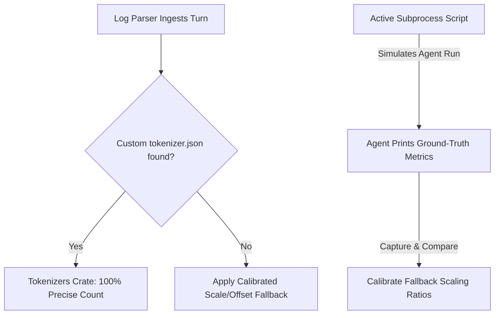

# Hybrid Tokenization Calibration & Simulation System

This document explains the design, motivation, and mechanics of the Hybrid Tokenization Calibration & Simulation System built for Codeoba.

---

## 1. The Core Problem
To display accurate metrics, Codeoba needs to track the number of **input (prompt) tokens** and **output (completion) tokens** consumed during developer sessions. 

However, local logs recorded by coding agents (like Cursor, Aider, and Claude Code) often do not contain the precise token counts for every individual message turn. We only get the raw text. Furthermore, LLMs are non-deterministic, and different model providers (OpenAI, Anthropic, Google, Meta) use completely different tokenization schemas (e.g., Tiktoken/cl100k_base, SentencePiece, Hugging Face BPE).

To display precise counts without sending every single text block back to a remote API just to count tokens (which would be slow, expensive, and require internet access), we need a way to count and verify tokens offline.

---

## 2. The Hybrid Solution

We use a **hybrid** approach combining **Offline Estimation (Option A)** and **Active Subprocess Simulation/Replay (Option B)**.



### Option A: Offline Local Tokenization (Fast & Approximate)
When parsing a session turn:
1. **Model Mapping**: We look at the model identifier (e.g., `gpt-4o`, `claude-3-5-sonnet`) and map it to a standard model family (`cl100k_base`, `claude`, `gemini`, `llama`, or `generic`).
2. **Hugging Face JSON Configuration**: If the user has saved an official Hugging Face tokenizer configuration JSON file under `~/.codeoba/tokenizers/<family>.json`, our Rust backend dynamically loads it using the `tokenizers` crate. This provides **100% precise offline token counts**.
3. **Calibrated Fallback Scales**: If no tokenizer configuration is found, we fall back to a linear scale-and-offset estimation based on the character length of the text:
   - **GPT-4 / GPT-3.5**: `Tokens = (Bytes * 0.263) + 2.0` (approx. 3.8 characters per token)
   - **Claude**: `Tokens = (Bytes * 0.256) + 3.0` (approx. 3.9 characters per token)
   - **Gemini**: `Tokens = (Bytes * 0.250) + 1.0` (approx. 4.0 characters per token)
   - **Llama**: `Tokens = (Bytes * 0.280) + 2.0` (approx. 3.6 characters per token)

### Option B: Active Agent Simulation (Verification & Ground-Truth Calibration)
To ensure our offline estimations are accurate and to verify our log parsers work properly under streaming conditions:
1. **Subprocess Execution**: The test suite runs a mock agent script or the actual agent CLI as a subprocess.
2. **Replay Script**: The driver feeds a deterministic sequence of prompts to the agent's stdin.
3. **Ground-Truth Calibration**: The agent executes the prompts, obtains real responses, and prints or logs the actual prompt and completion tokens.
4. **Validation**: The test harness captures the output, parses the generated log files, and validates:
   - That the parser successfully extracted all turns.
   - That our offline estimated tokens match or closely approximate the actual ground-truth tokens reported by the agent.

---

## 3. Verification
To run the automated calibration and tokenization tests, use:
```bash
cargo test -- --test-threads=1
```
